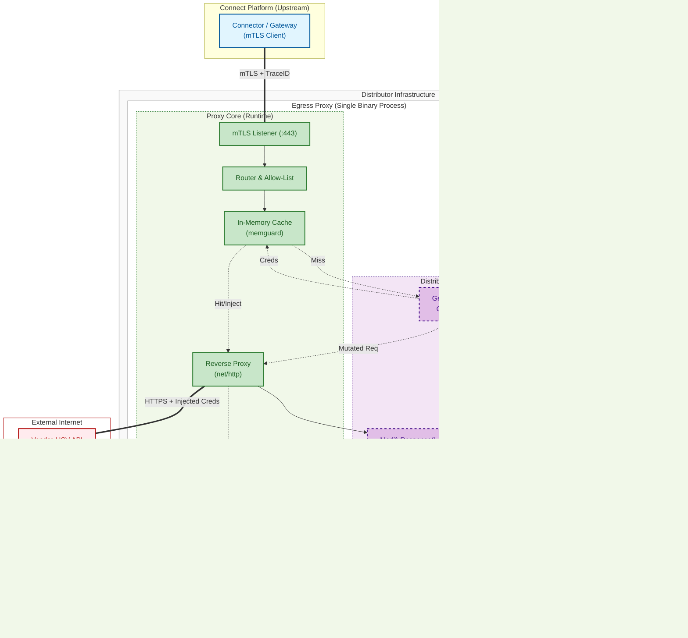
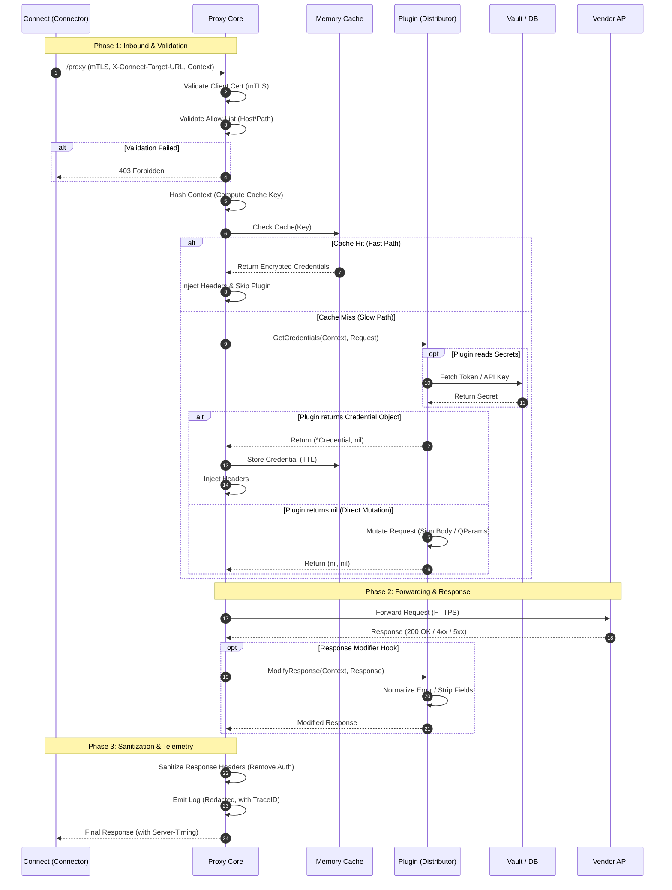

# DESIGN SPECIFICATION: Connect Egress Proxy

**Version:** 1.5

---

## 1. Terminology & Concepts

To ensure a shared understanding across all stakeholders:

* **Connect:** Our central SaaS platform for provisioning subscriptions and managing the marketplace.
* **Connector:** The specific component within the Connect platform that initiates requests to external APIs.
* **Distributor:** The partner/account that provisions new subscriptions. They are responsible for hosting the Egress Proxy in their infrastructure.
* **Vendor Account:** The account configuration within the Connect platform that publishes products.
* **ISV (Independent Software Vendor):** The external vendor entity itself (e.g., Microsoft, Adobe). We use this term to differentiate the external company/API from the internal "Vendor Account".
* **Egress Proxy (Chaperone):** The software component detailed in this document, named **Chaperone**. It runs on the Distributor's infrastructure to inject credentials. Throughout this document, "the Proxy", "the Core", and "Chaperone" refer to this component.
* **Credentials:** Sensitive authentication data (tokens, API keys, OAuth2 credentials) required to access the ISV's API. These are managed by the Distributor and injected by the Proxy.

## 2. Executive Summary

**Chaperone** (the Connect Egress Proxy) is a high-performance, sidecar-style reverse proxy designed to run within a Distributor's infrastructure. Its primary purpose is to **inject sensitive credentials** (authentication tokens, API keys, OAuth2 access tokens) into outgoing requests to Vendors (ISVs) without those credentials ever entering the Connect platform or leaking to the client.

This design prioritizes **security**, **latency**, and **operational simplicity** for the Distributor.

> **Note:** While this document references "Connect" as the primary upstream platform, the Proxy software itself is designed to be platform-agnostic. All protocol headers and configuration variables described below can be customized to work with other systems.

## 3. Architecture Overview

### 3.1 Component Diagram



### 3.2 Core Responsibilities

| Component | Responsibility |
| :--- | :--- |
| **Connect (Cloud)** | Orchestrates the provision request. Manages subscription lifecycles. Acts as the CA (Certificate Authority). Determines the specific Target URL. |
| **Proxy Core** | **Owns the Network Socket** to the ISV. Terminates mTLS. Validates Target Destinations (Host/Path Allow-list). Caches headers. Enforces timeouts and logging privacy. **Manages Certificate Lifecycle** (Tracking expiry, generating CSRs, hot-swapping). Includes the **Response Sanitizer** to scrub sensitive data before logging. |
| **Distributor Plugin** | A **Go-native software interface** compiled directly into the Proxy Core. Communicates via **in-memory function calls** (not RPC). Retrieves credentials and signs certificates via the configured upstream Authority. |

### 3.3 Technology Stack

The Egress Proxy is developed in **Go (Golang)** and is released as **Open Source** software.

* **Technology Choice:** Go was selected for its concurrency model and static binary capabilities (See **ADR-002** for detailed justification).
* **Core Library:** We utilize `net/http/httputil.ReverseProxy`, a battle-tested standard library used by major cloud-native gateways, ensuring production-grade HTTP handling.
* **Open Source Strategy:** Licensing the core as Open Source allows Distributors to audit the security of the component handling their secrets, building trust.

### 3.4 System Constraints & Compliance

* **Statelessness:** The Proxy Core is designed as a **Stateless Service**.
    * *Persistence:* It requires no internal database. Persistent data (Refresh Tokens, API Keys) is managed by external systems (Vaults, DBs, Environment Variables) accessed via the Plugin.
    * *Ephemeral State:* Caches and TLS Session Keys are held in RAM. A restart results in a cold cache but no data loss.
* **Dependency Policy:** To minimize the software supply chain attack surface, the Core adheres to a **"Standard Library First"** policy. External dependencies are restricted to critical security primitives (e.g., `memguard`) and strictly vetted.
* **License:** *(Proposal)* The software is released under the **Apache 2.0 License**, allowing Distributors to modify and bundle the proxy within their proprietary infrastructure without copyleft restrictions.

## 4. Key Architectural Decisions (ADR)

### ADR-001: Plugin Architecture via Static Recompilation ("The Caddy Model")

* **Context:** The Proxy requires custom logic from Distributors to retrieve credentials. We evaluated four options:
    1.  **RPC/gRPC Plugins (HashiCorp):** Running plugins as separate processes.
    2.  **WASM (WebAssembly):** Running plugins in a sandboxed runtime.
    3.  **Go Native Plugins (Shared Libraries):** Loading compiled `.so` files at runtime.
    4.  **Static Recompilation:** Compiling plugins directly into the main binary.
* **Decision:** We have selected **Static Recompilation**.
* **Justification:**
    * **Performance:** Code runs in the same memory space as the core. Zero network serialization overhead (0ms latency penalty).
    * **Capability:** Distributors have full access to the Go standard library and ecosystem (SQL drivers, AWS SDKs, etc.). WASM would severely restrict them (no file I/O, no sockets) or require complex host bridges.
    * **Reliability (Vs. Shared Libraries):** Go Native Plugins (`.so`) are extremely brittle; they require the plugin and the host to share exact dependency versions and Go compiler versions. This often leads to runtime crashes and "dependency hell." Static recompilation eliminates this class of errors entirely.
    * **Simplicity:** Deployment is a single static binary. No sidecar processes to manage or complex runtime dependencies to version match.
    * **Safety:** We operate in a high-trust environment (Distributor owns the infra), so strict sandboxing (WASM) is unnecessary overhead.

### ADR-002: Programming Language Selection (Go)

* **Context:** The proxy must handle thousands of concurrent requests with minimal footprint and be easy to deploy on diverse infrastructure (K8s, Bare Metal).
* **Decision:** We selected **Go (Golang)**.
* **Justification:**
    * **Concurrency & Performance:** Go's lightweight concurrency model (goroutines) allows the proxy to handle thousands of concurrent requests with minimal memory footprint.
    * **Deployment Simplicity:** Go compiles to a single, static binary with no external dependencies (no JVM, no Python virtual environments).
    * **Standard Library:** Go's robust `net/http` standard library allows us to build a production-grade proxy with minimal reliance on third-party dependencies.

### ADR-003: Hybrid Caching Strategy

* **Context:** We need to minimize the execution of Distributor code (performance) while supporting complex authentication schemas like Body Signing (flexibility).
* **Decision:** We selected a **Two-Tier "Hybrid" Interface**.
* **Justification:**
    * **Fast Path (Core Cache):** Designed for standard Headers (OAuth2 Bearer, API Keys). If the plugin returns a **Credential Object**, the Core stores it in an in-memory TTL cache (encrypted via `memguard`). Subsequent requests with the same Context Hash are served in **microseconds** without running Distributor code.
    * **Slow Path (Custom Logic):** Designed for complex auth (HMAC body signing, dynamic nonces). If the plugin returns `nil`, the Core assumes the request was mutated in a non-cacheable way. The plugin runs on every request.

### ADR-004: Split Module Versioning

* **Context:** We must ensure that security updates to the Proxy Core do not break the compilation of Distributor Plugins.
* **Decision:** We selected a **Split Module Strategy** (Core: `github.com/cloudblue/chaperone` vs SDK: `github.com/cloudblue/chaperone/sdk`).
* **Justification:** Decoupling the Interface (SDK) from the Runtime (Core) allows us to patch the Core without forcing Distributors to refactor their plugin code, provided the SDK version remains stable.

### ADR-005: Decoupled Configuration & Naming

* **Context:** The Proxy is an open-source tool. Hard-coding "Connect" into the logic limits reuse.
* **Decision:** All protocol identifiers (Headers, Env Vars) will be **configurable**.
* **Justification:**
    * **Defaults:** Defaults are set to Connect standards (e.g., `Connect-Request-ID`).
    * **Overrides:** Distributors using the proxy for other systems can configure `trace_header_name` or `header_prefix` in `config.yaml`.
    * **Result:** The documentation uses "Connect" terms for clarity, but the code is strictly vendor-neutral.

## 5. Functional Specifications

### 5.1 API & Routing Specification

The Proxy exposes specific endpoints for traffic provisioning and operational management. These are typically hosted on the **Traffic Port (default 443)** to simplify connectivity for the Upstream Platform (Connect).

#### A. Provisioning Endpoint

* **Path:** `* /proxy` (All HTTP Methods)
* **Purpose:** The sole entry point for subscription provisioning traffic.
* **Method Passthrough:** The HTTP method used to call the proxy is forwarded to the target URL. For example, `GET /proxy` forwards as `GET` to the vendor, `DELETE /proxy` forwards as `DELETE`, etc.
* **Behavior:**
    * Accepts the inbound mTLS connection.
    * Validates the `X-Connect-Target-URL` headers.
    * Triggers the Request Lifecycle.

#### B. Operational Endpoints (Vendor Neutral)

These endpoints allow the upstream client (Connect or generic) to verify the Proxy's status over the existing mTLS tunnel. They are also available on the **Management Port** for unauthenticated Distributor access (health checks, version verification).

* **Path:** `GET /_ops/health`
    * **Purpose:** Liveness probe. Returns `200 OK` (JSON: `{"status": "alive"}`) if the process is running and can accept traffic.
    * **Ports:** Traffic port (mTLS) and Management port (unauthenticated).
* **Path:** `GET /_ops/version`
    * **Purpose:** Returns the current Semantic Version of the Core and the SDK. Used by the client to negotiate protocol compatibility (N-2 support).
    * **Ports:** Traffic port (mTLS) and Management port (unauthenticated).

#### C. Internal Admin Endpoints (Distributor Ops)

* **Path:** `GET /metrics`
    * **Purpose:** Prometheus scraping endpoint for **Distributor Telemetry**.
    * **Audience:** Strictly for the Distributor's internal monitoring systems (Prometheus, Datadog, etc.). The Upstream Platform (Connect) does **not** consume this endpoint.
    * **Security Note:** By default, this endpoint is bound to a separate **Management Port (e.g., 9090)** or localhost. It contains sensitive business volume data (e.g., "Requests per Vendor") and **must not** be exposed to the public internet.
* **Path:** `GET /debug/pprof/`
    * **Purpose:** **Go Runtime Profiler** (CPU, Heap, Goroutines).
    * **Security Note:** Disabled by default. Must be enabled via config `observability.enable_profiling`. Strictly bound to the Management Port to prevent external access.

### 5.2 Request Lifecycle & Context

The protocol between Connect and the Proxy is strictly typed using HTTP Headers.

> **Note:** The `X-Connect-` prefix used below is the default configuration, but can be customized in `config.yaml`.

#### A. Inbound Context (From Connect)

The Core Proxy parses these headers into a `TransactionContext` struct:

* `X-Connect-Target-URL`: The full destination URL (e.g., `https://api.microsoft.com/v1/customers`).
* `X-Connect-Environment-ID`: The runtime environment identifier (e.g., `production`, `test`).
* `X-Connect-Marketplace-ID`: The specific marketplace ID (e.g., `US`, `EU`).
* `X-Connect-Vendor-ID`: The ID of the vendor account owning the product.
* `X-Connect-Product-ID`: The specific product SKU.
* `X-Connect-Subscription-ID`: The unique subscription ID.
* `X-Connect-Context-Data`: (Optional) A Base64-encoded JSON object containing any dynamic/additional context required for specific ISVs.

#### B. Routing & Injection Logic (Hybrid)



1.  **Validation:** Core extracts the `X-Connect-Target-URL`. It validates the **Host** and **Path** against the local `allow_list` configuration (See Section 5.3). If valid, the request proceeds; otherwise, `403 Forbidden` is returned.
2.  **Cache Lookup (Fast Path):** Core calculates a deterministic hash of the Context. It checks the in-memory `memguard` cache.
    * *Hit:* Injects cached headers immediately. **Plugin execution is skipped entirely.**
    * *Miss:* Proceed to Plugin Execution (Slow Path).
3.  **Plugin Execution (Slow Path):** The plugin receives the Context and a **pointer** to the Request (`req *http.Request`). It decides:
    * *Standard Credential:* Returns a `*Credential` object (headers + TTL). Core injects the headers and stores the object in the cache.
    * *Complex Mutation:* Returns `nil, nil`. This signals that the Plugin has mutated the request pointer directly (e.g., signing the body, adding query params). The Core **does not cache** this result, and the plugin will run on every subsequent request.
    * *Context Propagation:* The Core passes a `context.Context` with a timeout bound to the plugin. This context is cancelled if the upstream client disconnects or if the request timeout is exceeded. Plugins performing network I/O (Vault, OAuth, HTTP) **should** respect this context to avoid resource leaks.
4.  **Forwarding:** The Proxy Core (not the plugin) opens the socket and forwards the mutated request to the ISV, enforcing global timeouts.
5.  **Response Handling & Sanitization:**
    * **Streaming Support:** The Proxy supports streaming responses (via `http.Flusher`) for vendors that return data incrementally (e.g., LLM/AI services). Response data is forwarded to the client as it arrives without full buffering.
    * **Plugin Hook:** Upon receiving the response, the Core calls `ModifyResponse`. The distributor can normalize errors or strip PII here.
    * **Core Safety Net:** Finally, the Core runs the **Response Sanitizer**, which unconditionally strips dangerous headers (e.g., `Authorization`) before the response is returned to Connect or logged. This ensures that a misconfigured plugin cannot accidentally leak credentials back upstream.

### 5.3 Security Controls

* **Authentication:** Mutual TLS (mTLS) is mandatory. The Proxy validates the Connect Client Certificate against the Connect CA bundle.
* **Traffic Validation (Allow-List):** The Proxy operates as a **Validating Forwarder**. It enforces strict whitelisting on the `Target-URL` provided by Connect.
    * **Mechanism:** The Proxy validates both the **Domain** and the **Path** against the `allow_list` defined in `config.yaml`.
    * **Syntax:** We support **Glob Patterns** (DoubleStar) for flexibility.
        * `*`: Single-level wildcard (matches content within a segment, does not cross separators).
        * `**`: Multi-level/Recursive wildcard (matches across separators).
        * *Separators:* Dot (`.`) for Domains, Slash (`/`) for Paths.
* **Credential Reflection Protection:** The Proxy strips all "Injection Headers" (like `Authorization`) from the **Response** before sending it back to Connect.
* **Error Masking:**
    * Upstream `400/500` errors are intercepted.
    * The body is replaced with a generic error by default (safety net).
    * Plugins can opt out by returning `ResponseAction{SkipErrorNormalization: true}` from `ModifyResponse` - useful when ISV validation errors need to be passed through to Connect.
    * Original error bodies are logged at DEBUG level for Distributor troubleshooting but never returned to Connect unless the plugin explicitly opts out.
* **Sensitive Data Redaction:**
    * **Header Redaction:** The logger is configured with a strict "Redact List" (e.g., `Authorization`, `Proxy-Authorization`, `Cookie`, `X-API-Key`). These headers are replaced with `[REDACTED]` in all output.
    * **Body Safety:** Request and Response **bodies** are excluded from logs by default. Debug logging (which includes bodies) can only be enabled via an explicit environment variable and must emit a startup warning.

### 5.4 Versioning & Backward Compatibility

To manage the disparate fleet of Proxies running different versions, we apply the following policies:

1.  **Module Separation (Build Stability):**
    * The project is split into two Go modules: `github.com/cloudblue/chaperone/sdk` (Interfaces) and `github.com/cloudblue/chaperone` (Runtime).
    * The SDK version is decoupled from the Core. Distributors can safely upgrade the Core to get security patches without modifying their plugin code, as long as the SDK Major Version (`v1`) remains stable.

2.  **Connect Support Lifecycle (Runtime Stability):**
    * Connect guarantees support for the current Major Protocol Version and the **two previous major versions (N-2)**.
    * **Additive Changes:** New protocol fields (e.g., new Context headers) are added without removing old ones. Older proxies are designed to ignore unknown headers ("Tolerant Reader"), allowing mixed versions to coexist.
    * **Breaking Changes:** If a breaking change is mandatory, Connect will verify the Proxy's version (reported via `User-Agent` or Registration) and adapt the request payload accordingly.

3.  **Version Reporting:**
    * The Proxy reports its version in the `User-Agent` header (e.g., `Connect-Proxy/1.2.0`) on all outbound requests to Connect (cert rotation, health checks, etc.) to aid in fleet management.

### 5.5 Configuration Specification

The Proxy is configured via a YAML file (`config.yaml`). Environment variables can override any value (following the 12-Factor App methodology), useful for injecting secrets like the initial mTLS password.

#### A. Configuration File Structure

```yaml
server:
  addr: ":443"             # Traffic Port
  admin_addr: ":9090"      # Management Port (Metrics)
  tls:
    cert_file: "/certs/proxy.crt"
    key_file: "/certs/proxy.key"
    ca_file: "/certs/connect-ca.crt"
    auto_rotate: true      # Enable internal rotation logic

upstream:
  # Decoupling Configuration (Default values match Connect Platform)
  header_prefix: "X-Connect"
  trace_header: "Connect-Request-ID"

  # The Allow-List: Maps Domains (Glob) to Allowed Paths (Glob)
  # Syntax:
  #   * = Matches single level (e.g., *.google.com matches api.google.com but NOT a.b.google.com)
  #   ** = Matches recursive (e.g., **.microsoft.com matches a.b.c.microsoft.com)
  allow_list:
    # Example 1: Strict single-level matching
    "api.partnercenter.microsoft.com":
      - "/v1/customers/*/profiles"     # Allow specific sub-resource
      - "/v1/invoices/**"              # Allow all paths under /invoices/

    # Example 2: Recursive Domain matching (Use with caution)
    "**.amazonaws.com":
      - "/my-specific-bucket/**"       # Only allow access to specific bucket paths

    # Example 3: Legacy/Simple style
    "api.adobe.com":
      - "/**"                          # Allow any path on this host

  timeouts:
    connect: 5s            # Connection establishment timeout
    read: 30s              # Max time waiting for response headers
    write: 30s             # Max time for writing the response
    idle: 120s             # Keep-alive connection timeout
    keep_alive: 30s        # TCP keep-alive probe interval
    plugin: 10s            # Max time for plugin credential fetch

observability:
  log_level: "info"        # debug, info, warn, error
  enable_profiling: false  # Enables /debug/pprof on Admin Port. Use with caution.

  # Privacy: Headers to strictly redact from logs
  sensitive_headers:
    - "Authorization"
    - "Set-Cookie"
    - "X-API-Key"
    - "Proxy-Authorization"
```

#### B. Environment Variable Overrides

* Syntax: `PROXY_<SECTION>_<KEY>` (Uppercase, Underscore separator).
* Example: `PROXY_SERVER_ADDR=":8443"` overrides `server.addr`.
* *(Note: The prefix is simply `PROXY_`, removing the "Connect" brand from the env var name)*.

## 6. Deployment & Network Strategy

The Proxy is designed to support various infrastructure capabilities. We define two **Termination Modes** (Network Topologies) and detail how they map to supported **Deployment Platforms**.

### 6.1 Termination Modes (Network Topology)

* **Mode A: Standalone / Direct (MVP Target)**
    * **Description:** The Proxy handles mTLS termination directly. It enforces validation of the Connect Client Certificate.
    * **Requirements:** Must be exposed via a TCP (Layer 4) path.
    * **Certificate Management:** Proxy handles generation and rotation automatically (For MVP only manual rotation is targeted: it requires replacing the files and restarting the process/container).

* **Mode B: Behind Web Server / Offloaded (Phase 2 / Future)**
    * **Description:** An upstream Web Server (Nginx, K8s Ingress, ALB) terminates mTLS and forwards traffic to the Proxy over HTTP.
    * **Requirements:** The Proxy trusts the upstream identity (via `X-Forwarded-Client-Cert` headers) and allows traffic only from the Web Server's IP.
    * **Certificate Management:** Offloaded to the Distributor's infrastructure.

### 6.2 Deployment Platforms

We define specific support tiers for deployment. **Docker is the primary First-Class citizen** for both development and production distribution.

#### 6.2.1 Containerized (Docker) - **[Primary Support]**

The standard and recommended delivery mechanism.

* **Mechanism:** The repository includes a multi-stage `Dockerfile` that builds the binary and packages it into a minimal Alpine/Distroless image.
* **Usage (Mode A):** Run directly with port mapping for standalone termination.
  `docker run -p 443:443 -v /certs:/certs my-proxy:latest`
* **Usage (Mode B):** Run on an internal port (e.g., 8080) inside a private bridge network, accepting traffic only from the upstream web server container.

#### 6.2.2 Kubernetes (K8s) - **[Reference Only]**

Supported via static manifest files.

* **Mechanism:** We provide **Reference YAML manifests** that Distributors can copy and adapt. We do **not** provide Helm charts or Operators in the MVP.
* **Mode A (TCP Pass-through):** Requires a Service of type `LoadBalancer` or `NodePort`. Standard Ingress resources cannot be used as they terminate TLS prematurely.
* **Mode B (Ingress Chaining):** Standard `ClusterIP` Service deployment. Traffic enters via an Ingress Controller (Nginx/Traefik) which forwards to the Proxy.

#### 6.2.3 Bare Metal (Linux VM) - **[Manual / Documentation]**

Supported via manual binary execution.

* **Mechanism:** Distributors must manually compile the binary (using `go build`) or extract it from the Docker image.
* **Service Management:** We provide a sample **Systemd Unit file** (`.service`) and `README` instructions.
* **Mode A (Privileged):** Requires `setcap cap_net_bind_service` to allow the binary to bind to port 443 without root privileges.
* **Mode B (Localhost):** The Proxy binds to `localhost:8080`. The Distributor configures their existing Apache/Nginx to `proxy_pass` traffic to this local port.

### 6.3 Network Positioning & Firewalling

Regardless of the platform, the Proxy sits at the Distributor's network edge.

* **Inbound Rules:**
    * **Mode A:** Allow TCP/443 from Connect Platform IPs.
    * **Mode B:** Allow HTTP/8080 *only* from the local Web Server/Load Balancer (Deny Public Internet).

* **Outbound Rules:**
    * Allow egress via HTTPS (443) to the specific Vendor API hosts defined in the `allow-list`.

### 6.4 Deployment Matrix (Summary)

| Feature                                   | Container / Docker                                               | Kubernetes (K8s)                                                                | Bare Metal (Linux)                                                                |
| :---------------------------------------- | :-------------------------------------------------------------   | :------------------------------------------------------------------------------ | :-------------------------------------------------------------------------------- |
| **Mode A (MVP)** <br> *(Standalone)*      | **Cmd:** `docker run -p 443:443` <br> **Net:** Host / Port Map   | **Svc:** `LoadBalancer` (TCP) <br> **Ingress:** None <br> **Certs:** K8s Secret | **Service:** Systemd <br> **Port:** 443 <br> **Priv:** `setcap` cap_net_bind      |
| **Mode B (Future)** <br> *(Behind Proxy)* | **Cmd:** `docker run -p 8080`<br> **Net:** Private/Internal      | **Svc:** `ClusterIP` <br> **Ingress:** Nginx/Traefik <br> **Certs:** On Ingress | **Service:** Systemd <br> **Port:** 8080 (Localhost) <br> **Front:** Apache/Nginx |
| **Certificate Rotation**                  | **Mode A:** Manual/Auto-managed <br> **Mode B:** Manual/External | **Mode A:** Manual/Auto-managed <br> **Mode B:** Cert-Manager                   | **Mode A:** Manual/Auto-managed <br> **Mode B:** Manual (Cron)                    |

## 7. Implementation Guide (The "Builder" Pattern)

The Distributor does not edit the Proxy source code. They create a custom build that imports the Core and their own Plugin. The Plugin Interface is defined in the `sdk` module.

**Project Structure (Monorepo):**

The Chaperone repository is organized as a multi-module monorepo:

```text
/chaperone
  ├── go.mod                 <-- Core module: github.com/cloudblue/chaperone
  ├── chaperone.go           <-- Public API: Run(), Option types
  ├── cmd/chaperone/         <-- Default CLI entry point (wraps chaperone.Run)
  ├── sdk/                   <-- SDK module: github.com/cloudblue/chaperone/sdk
  │   ├── go.mod             <-- Versioned independently (sdk/v1.x.x)
  │   └── plugin.go          <-- Plugin interface definitions
  ├── plugins/
  │   └── reference/         <-- Default file-based plugin
  └── internal/              <-- Core implementation (private)
```

**Distributor Custom Build:**

Distributors create their own repository, import both the SDK (for plugin interfaces) and the Core (for `chaperone.Run`), and compile a single binary:

```text
/my-proxy-build
  ├── go.mod             <-- Deps: chaperone v1.x, chaperone/sdk v1.x
  ├── main.go            <-- Calls chaperone.Run() with custom Plugin
  └── plugins/
      └── my_vault.go    <-- Distributor Custom Logic (Vault, OAuth2, etc.)
```

**Distributor main.go Example:**

```go
package main

import (
    "context"
    "os"
    "os/signal"
    "syscall"

    "github.com/cloudblue/chaperone"
    myplugin "github.com/acme/my-proxy-build/plugins"
)

func main() {
    ctx, stop := signal.NotifyContext(context.Background(), syscall.SIGTERM, syscall.SIGINT)
    defer stop()

    if err := chaperone.Run(ctx, myplugin.New(),
        chaperone.WithConfigPath("/etc/chaperone.yaml"),
        chaperone.WithVersion("1.0.0"),
    ); err != nil {
        os.Exit(1)
    }
}
```

*(Note: The repository includes a default **reference plugin** (`plugins/reference/`) that reads credentials from a local JSON file. This plugin is suitable for testing and simple deployments.)*

**The Contract (Go Interface - Defined in `sdk` module):**

*(Source of truth: `sdk/plugin.go`, `sdk/context.go`, `sdk/credential.go`)*

```go
// Provided by github.com/cloudblue/chaperone/sdk
type TransactionContext struct {
    TraceID        string         // Correlation ID for distributed tracing
    TargetURL      string         // Full destination URL (validated against allow-list)
    EnvironmentID  string         // {HeaderPrefix}-Environment-ID
    MarketplaceID  string         // {HeaderPrefix}-Marketplace-ID
    VendorID       string         // {HeaderPrefix}-Vendor-ID
    ProductID      string         // {HeaderPrefix}-Product-ID
    SubscriptionID string         // {HeaderPrefix}-Subscription-ID
    Data           map[string]any // Unmarshaled from {HeaderPrefix}-Context-Data (JSON)
}

type Credential struct {
    Headers   map[string]string // Headers to inject
    ExpiresAt time.Time         // TTL for Core Cache
}

// THE PLUGIN INTERFACE
// Distributors implement this interface to inject logic.
type Plugin interface {
    CredentialProvider
    CertificateSigner
    ResponseModifier
}

// 1. CREDENTIALS INTERFACE
type CredentialProvider interface {
    // GetCredentials supports both Fast Path (Caching) and Slow Path (Mutation).
    //
    // 1. FAST PATH: Return (*Credential, nil).
    //    Core will cache the headers and inject them. Plugin skipped next time.
    //
    // 2. SLOW PATH: Mutate 'req' directly and return (nil, nil).
    //    Core will NOT cache. Plugin runs on every request.
    GetCredentials(ctx context.Context, tx TransactionContext, req *http.Request) (*Credential, error)
}

// 2. CERTIFICATE SIGNING INTERFACE
type CertificateSigner interface {
    // SignCSR receives a PEM-encoded CSR generated by the Core.
    // It must return the PEM-encoded Certificate (CRT) signed by the CA.
    // This allows Distributors to use Connect, Vault, or other CAs.
    SignCSR(ctx context.Context, csrPEM []byte) (crtPEM []byte, err error)
}

// 3. RESPONSE MODIFICATION
//
// ResponseAction tells the Core how to handle the response after plugin processing.
// Return nil from ModifyResponse for default behavior (Core applies error normalization).
type ResponseAction struct {
    SkipErrorNormalization bool // When true, ISV error bodies pass through to upstream
}

type ResponseModifier interface {
    // ModifyResponse allows the Distributor to inspect or mutate the response
    // BEFORE it is returned to Connect.
    // Use cases: Stripping PII, normalizing error codes, logging specific response fields,
    // passing through ISV validation errors via ResponseAction.
    // NOTE: Reading resp.Body will buffer the stream, which may impact performance.
    ModifyResponse(ctx context.Context, tx TransactionContext, resp *http.Response) (*ResponseAction, error)
}
```

**Example Implementations (Distributor Logic):**

```go
func (p MyPlugin) GetCredentials(ctx context.Context, tx TransactionContext, req *http.Request) (*Credential, error) {
    // Case 1: Microsoft (Fast Path)
    if tx.VendorID == "microsoft" {
        token := fetchAzureToken()
        return &Credential{
            Headers: map[string]string{"Authorization": "Bearer " + token},
            ExpiresAt: time.Now().Add(1 * time.Hour),
        }, nil
    }

    // Case 2: Legacy API with Query Param (Slow Path)
    if tx.VendorID == "legacy_app" {
        q := req.URL.Query()
        q.Add("api_key", os.Getenv("LEGACY_KEY"))
        req.URL.RawQuery = q.Encode()
        return nil, nil // Return nil to skip caching
    }

    return nil, fmt.Errorf("unknown vendor")
}
```

```go
// Implementing the Signer to use a proprietary Vault
func (p MyPlugin) SignCSR(ctx context.Context, csrPEM []byte) ([]byte, error) {
    // 1. Auth against internal Vault
    client := myVault.NewClient(os.Getenv("VAULT_TOKEN"))
    
    // 2. Send CSR to Vault's PKI backend
    crt, err := client.Sign("connect-pki-role", csrPEM)
    if err != nil {
        return nil, err
    }
    
    return crt, nil
}
```

```go
func (p MyPlugin) ModifyResponse(ctx context.Context, tx TransactionContext, resp *http.Response) (*ResponseAction, error) {
    // Example: Strip internal headers from Microsoft before returning to Connect
    resp.Header.Del("X-Internal-Debug-ID")

    // Example: Normalize a confusing upstream error
    if resp.StatusCode == 200 && resp.Header.Get("X-Status") == "Fail" {
        resp.StatusCode = 400
    }

    // Return nil for default behavior (Core applies error normalization).
    // Return &ResponseAction{SkipErrorNormalization: true} to pass through ISV errors.
    return nil, nil
}
```

## 8. Operational Requirements

### 8.1 Resilience & Reliability

The proxy is designed to prioritize availability and stability ("always up") even under adverse conditions.

* **Panic Recovery (Middleware):** The core includes a top-level recovery middleware. If a request causes a crash (panic)—whether in the core or in a Distributor's plugin—the proxy will catch the error, log the stack trace locally, return a `500 Internal Server Error` to Connect, and **continue running** without interruption.
* **Graceful Shutdown:** The server handles system signals (`SIGTERM`, `SIGINT`). Upon receiving a stop signal, it stops accepting new connections but allows in-flight requests to complete (within a configurable timeout) before exiting. This ensures zero-downtime during updates or restarts.
* **Connection Hardening:** To prevent resource exhaustion attacks (like Slowloris) or hung connections from upstream Vendors, the proxy enforces strict, configurable **timeouts** on all Read, Write, and Idle operations.

### 8.2 Deployment & mTLS Enrollment (Mode A only)

*(Note: In Mode B, certificate management is offloaded to the Distributor's infrastructure tools.)*

1.  **Bootstrap:** Distributor runs `./chaperone enroll --domains proxy.example.com`.
    * Generates Key Pair (ECDSA P-256).
    * Generates CSR (Certificate Signing Request).
2.  **Registration:** Distributor uploads CSR to Connect Portal (or their CA).
3.  **Trust:** The CA signs CSR and returns:
    * `server.crt` - The signed server certificate.
    * `ca.crt` - The CA certificate (for verifying client certificates).
4.  **Run:** `docker run -v certs:/certs my-compiled-proxy`
5.  **Rotation (Decoupled Logic):**
    * **Proxy Core:** Tracks certificate expiry. At `Expiry - 7 Days`, generates a new Key Pair and CSR.
    * **Plugin Call:** The Core calls `CertificateSigner.SignCSR(csr)` passing the new CSR.
    * **Distributor Logic:** The Plugin forwards the CSR to the configured CA (Connect API, Vault, etc.) and returns the signed CRT.
    * **Hot-Swap:** The Core receives the new CRT, verifies it matches the Key, and updates the TLS listener in memory without dropping connections.

### 8.3 Observability & Telemetry

The Proxy is designed to be "Observable by Default" using Cloud-Native standards. Telemetry data is **owned by the Distributor**, but structured to allow end-to-end correlation with the Upstream Platform (Connect) and **Performance Attribution**.

* **1. Distributed Tracing (Correlation & Chain of Custody):**
    * **Purpose:** Enables End-to-End visibility in tools like **Azure Application Insights** or **Datadog**. It allows engineers to trace a single transaction from the Platform, through the Proxy, to the Vendor.
    * **Mechanism:** The Proxy passively propagates the upstream Correlation ID.
    * **Header Standard:** Listens for the configured `trace_header` (Default: `Connect-Request-ID`).
    * **Behavior:**
        * **Inbound:** Extracts the ID from the Upstream Client. If missing (e.g., local testing), generates a UUIDv4.
        * **Propagation (Downstream):** The ID is injected into the **Plugin Context** (so Distributors can attach it to their custom logic logs) and the **Vendor Request** (to assist in cross-company debugging with the ISV).
        * **Propagation (Logs):** Every log line emitted by the Proxy includes `"trace_id": "..."`.
    * **Workflow:**
        1.  Connect generates ID `abc-123` and logs "Start".
        2.  Proxy receives `abc-123`, logs it, and passes it to the Vendor.
        3.  *Result:* An engineer can search for `abc-123` in the Distributor's logs to instantly find the exact proxy execution corresponding to a specific failure in the Connect Portal.

* **2. Metrics (Performance Telemetry):**
    * **Purpose:** Aggregate health monitoring (Rates, Errors, Latency) for the Distributor's Operations team.
    * **Standard:** Prometheus Text Format (Pull Model).
    * **Endpoint:** Exposed on the internal Management Port (`/metrics`).
    * **Key Indicators:**
        * `proxy_requests_total{vendor_id="...", status="..."}`: Measures business volume and error rates per vendor.
        * `proxy_latency_seconds_bucket`: Histogram for calculating P95/P99 latency.
        * `proxy_step_duration_seconds`: Histogram broken down by step ("plugin", "upstream", "overhead"). This is the primary metric for blaming slow components.

* **3. Performance Attribution (Server-Timing):**
    * **Purpose:** Allows the Upstream Platform (Connect) to see *why* a request was slow without accessing the Distributor's internal metrics.
    * **Mechanism:** The Proxy appends the standard `Server-Timing` header to the response sent back to Connect.
    * **Format:** `Server-Timing: plugin;dur=150, upstream;dur=320, overhead;dur=2`
    * **Interpretation:**
        * `plugin`: Time spent executing the Distributor's custom logic (e.g., Vault lookups).
        * `upstream`: Time spent waiting for the ISV (Microsoft/Adobe) to reply.
        * `overhead`: Time spent in the Proxy Core (mTLS, serialization).

* **4. Deep Profiling (pprof):**
    * **Purpose:** Low-level debugging of CPU spikes, memory leaks, or deadlocks within the binary.
    * **Mechanism:** The standard Go `net/http/pprof` endpoints are exposed on the Admin Port when `enable_profiling` is set to `true`.
    * **Use Case:** Critical for Distributors to debug complex performance issues in their own infrastructure.

* **5. Structured Logs (Audit & Debug):**
    * **Format:** JSON (Newlines) output to `STDOUT`/`STDERR`.
    * **Content:** Every request emits a log line including `trace_id`, `latency`, `upstream_status`, `vendor_id`, and `client_ip`.
    * **Privacy:** The Core enforces a strict **Redaction List** (defined in Config). Headers like `Authorization` or `Cookie` are replaced with `[REDACTED]` before writing.

> **Note on OpenTelemetry (OTel):** While this version utilizes the **Prometheus** standard for metrics (due to its universal support and simple pull-model), the design is conceptually aligned with OpenTelemetry.
>
> * **Tracing:** The correlation IDs injected by the proxy are compatible with OTel Distributed Tracing standards.
> * **Future Roadmap:** Full native support for the OpenTelemetry SDK (OTLP Exporters) to push metrics and traces directly to a Collector is planned for a future release.

## 9. Quality Assurance & Testing Strategy

Since the Egress Proxy handles sensitive credentials and sits in the critical path of provisioning, we employ a rigorous "Shift-Left" testing strategy.

### 9.1 The Testing Pyramid

#### A. Unit Testing (Core Logic)

* **Scope:** Configuration parsing, Context hashing, Redaction logic, Cache TTL behavior.
* **Tooling:** Standard Go `testing` package.
* **Requirement:** 80%+ Code Coverage for the Core module.

#### B. Integration Testing (The "Mock" World)

* **Scope:** Verifying the mTLS handshake, Plugin Interface contract, and HTTP mechanics.
* **Implementation:** We utilize Go's `net/http/httptest` to create ephemeral, in-memory servers during `go test`.
    * **Mock Connect:** Simulates incoming mTLS requests with various headers.
    * **Mock Vendor:** Simulates the ISV API (returning 200, 401, 500, timeouts).
    * **Scenario:** Connect calls Proxy -> Proxy calls Mock Plugin -> Proxy calls Mock Vendor -> Verify Response.

#### C. Plugin Compliance Suite (Contract Testing)

* **Problem:** Distributors write their own plugins, which might crash or misbehave.
* **Solution:** The SDK includes a **Compliance Test Kit** (`sdk/compliance` package).
* **Usage:** Distributors write a simple test in their repo that imports the Kit:

```go
import "github.com/cloudblue/chaperone/sdk/compliance"

func TestMyPluginCompliance(t *testing.T) {
    p := &MyPlugin{}
    // Verifies the plugin handles Context, returns Valid/Invalid credentials, 
    // and doesn't panic on nil inputs.
    compliance.VerifyContract(t, p) 
}
```

### 9.2 Security Testing

#### A. Negative Testing

* **Scope:** "Sad Path" validation.
* **Scenarios:**
    * **Network:** Upstream Vendor hangs (verify Timeout works).
    * **Security:** Request missing mTLS cert (verify 401).
    * **Data:** Malformed `X-Connect-Context-Data` (verify 400, no panic).

#### B. Fuzz Testing (Native Go Fuzzing)

* **Scope:** Input parsing functions.
* **Mechanism:** We use Go 1.18+ native fuzzing to generate random, malformed inputs against the **Header Parser** and **Config Loader** to identify edge cases that cause crashes (panics) or memory leaks.

### 9.3 Performance Testing

#### A. Benchmark Testing (Go Native)

* **Tooling:** Go `testing.Benchmark` with `benchstat` for regression detection.
* **Scope:**
    * **Micro-benchmarks:** Context parsing, hashing, glob matching, header manipulation.
    * **Component benchmarks:** Middleware overhead, response sanitization, TLS handshake.
    * **End-to-end benchmarks:** Full request cycle with mock upstream.
* **Key Metrics:**
    * Allocations per request (target: < 50 allocs/op)
    * Bytes per request (target: < 4KB/op)
    * Proxy overhead excluding upstream (target: < 100μs)
    * TLS handshake time (target: < 5ms for mTLS)
* **Regression Policy:** CI fails if any metric degrades > 10%.
* **Execution:** Benchmarks run in CI (~30-60s) to catch performance regressions early.

#### B. Load Testing (k6)

* **Tooling:** Grafana k6 for HTTP load generation.
* **Scenarios:**
    * **Baseline:** Steady traffic (e.g., 100 VUs for 5 minutes) to establish performance baseline.
    * **Spike:** Sudden traffic surge (10x normal) to test resilience and recovery.
    * **Stress:** Gradually increasing load until failure to find system limits.
    * **Soak:** Extended duration (4+ hours) at moderate load to detect memory leaks and connection exhaustion.
* **mTLS Testing:** All scenarios include client certificate authentication to validate TLS performance under load.
* **Success Criteria:**
    * P99 latency < 50ms (excluding upstream)
    * Error rate < 0.1%
    * No memory leaks (heap stable over soak test)
    * No goroutine leaks

#### C. Profiling Integration

* **CPU Profiling:** Identify hot functions under load via `/debug/pprof/profile`.
* **Memory Profiling:** Detect allocation patterns and leaks via `/debug/pprof/heap`.
* **Block Profiling:** Find contention points (mutexes, channels) via `/debug/pprof/block`.
* **Goroutine Profiling:** Detect goroutine leaks via `/debug/pprof/goroutine`.

#### D. Performance Attribution

* **Mechanism:** The Proxy appends the standard `Server-Timing` header to responses.
* **Format:** `Server-Timing: plugin;dur=150, upstream;dur=320, overhead;dur=2`
* **Interpretation:**
    * `plugin`: Time spent executing Distributor's custom logic.
    * `upstream`: Time spent waiting for ISV to reply.
    * `overhead`: Time spent in Proxy Core (mTLS, serialization).
