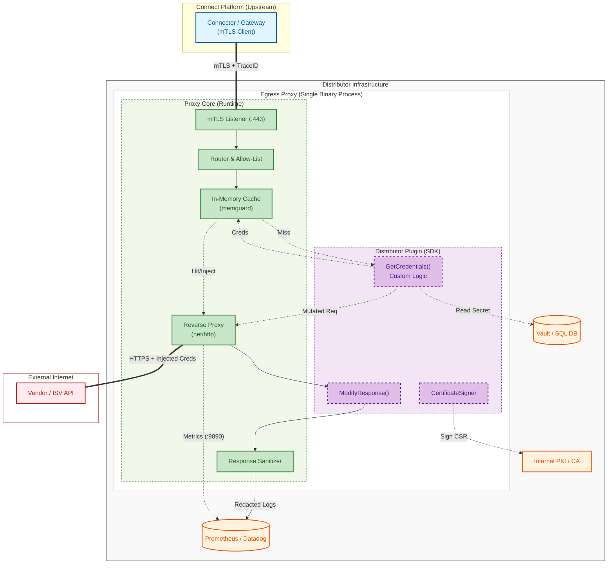
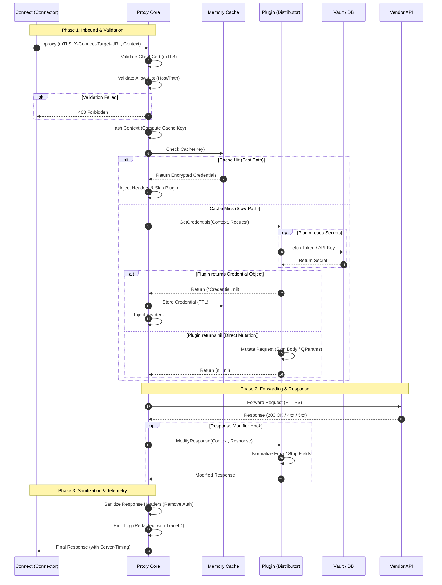

# Design specification: Connect Egress Proxy

**Version:** 2.0

---

This document explains the architectural decisions, conceptual models, and design rationale behind Chaperone. For implementation details, see the [reference documentation](../reference/) and [how-to guides](../guides/).

## 1. Terminology & concepts

* **Connect:** The central SaaS platform for provisioning subscriptions and managing the marketplace.
* **Connector:** The component within the Connect platform that initiates requests to external APIs.
* **Distributor:** The partner that provisions subscriptions. Distributors host Chaperone in their own infrastructure.
* **Vendor Account:** The account configuration within Connect that publishes products.
* **ISV (Independent Software Vendor):** The external vendor entity (e.g., Microsoft, Adobe). Distinct from the internal "Vendor Account".
* **Egress Proxy (Chaperone):** The software component detailed in this document. It runs on the Distributor's infrastructure to inject credentials. Throughout this document, "the Proxy", "the Core", and "Chaperone" refer to this component.
* **Credentials:** Sensitive authentication data (tokens, API keys, OAuth2 credentials) required to access the ISV's API. Managed by the Distributor and injected by the Proxy.

## 2. Executive summary

**Chaperone** is a sidecar-style reverse proxy that runs within a Distributor's infrastructure. It injects sensitive credentials into outgoing requests to ISVs without those credentials ever entering the Connect platform or leaking to the client.

The design prioritizes **security**, **latency**, and **operational simplicity** for the Distributor.

> **Note:** While this document references "Connect" as the primary upstream platform, the Proxy is platform-agnostic. All protocol headers and configuration variables can be customized to work with other systems (see [ADR-005](#adr-005-decoupled-configuration--naming)).

## 3. Architecture overview

### 3.1 Component diagram

### 3.2 Core responsibilities

| Component | Responsibility |
| :--- | :--- |
| **Connect (Cloud)** | Orchestrates provision requests. Manages subscription lifecycles. Acts as the CA. Determines the Target URL. |
| **Proxy Core** | Owns the network socket to the ISV. Terminates mTLS. Validates target destinations against the allow-list. Caches credentials. Enforces timeouts and logging privacy. Manages certificate lifecycle. Runs the response sanitizer. |
| **Distributor Plugin** | A Go-native interface compiled directly into the Proxy Core. Communicates via in-memory function calls (not RPC). Retrieves credentials and signs certificates via the Distributor's chosen authority. |

### 3.3 Technology choices

Chaperone is written in **Go** and released as open source under the **Apache 2.0 License**.

* **Why Go:** Goroutine-based concurrency, single static binary, strong `net/http` standard library. See [ADR-002](#adr-002-programming-language-selection-go).
* **Core HTTP library:** `net/http/httputil.ReverseProxy` from the standard library.
* **Open source rationale:** Distributors can audit the code that handles their secrets.

### 3.4 System constraints

* **Statelessness:** The Proxy Core requires no database. Persistent data (refresh tokens, API keys) lives in external systems (Vault, DBs, environment variables) accessed via the Plugin. Caches and TLS session keys are held in RAM — a restart clears the cache but loses no data.
* **Dependency policy:** To minimize supply chain attack surface, the Core follows a "Standard Library First" policy. External dependencies are restricted to critical security primitives (e.g., `memguard`) and strictly vetted.

## 4. Key architectural decisions (ADR)

### ADR-001: Plugin architecture via static recompilation ("The Caddy Model")

* **Context:** The Proxy needs custom Distributor logic to retrieve credentials. We evaluated four options:
    1. **RPC/gRPC Plugins (HashiCorp):** Plugins as separate processes.
    2. **WASM (WebAssembly):** Plugins in a sandboxed runtime.
    3. **Go Native Plugins (Shared Libraries):** Loading compiled `.so` files at runtime.
    4. **Static Recompilation:** Compiling plugins directly into the main binary.
* **Decision:** Static Recompilation.
* **Rationale:**
    * **Performance:** Code runs in the same memory space. Zero serialization overhead.
    * **Capability:** Distributors get full access to the Go ecosystem (SQL drivers, AWS SDKs, etc.). WASM would restrict file I/O and sockets or require complex host bridges.
    * **Reliability vs. shared libraries:** Go `.so` plugins require exact dependency and compiler version matching. This leads to runtime crashes and "dependency hell." Static recompilation eliminates this class of errors.
    * **Simplicity:** Single static binary. No sidecar processes to manage.
    * **Safety:** Distributors own the infrastructure, so strict sandboxing (WASM) adds overhead without proportional benefit.
* **Contrib building blocks:** The [`plugins/contrib`](../reference/contrib-plugins.md) module provides reusable auth flow implementations (OAuth2 client credentials, refresh token grant, Microsoft Secure Application Model) and a request multiplexer. Distributors compose these building blocks instead of writing auth logic from scratch.

### ADR-002: Programming language selection (Go)

* **Context:** The proxy must handle thousands of concurrent requests with minimal footprint and deploy easily across diverse infrastructure.
* **Decision:** Go.
* **Rationale:**
    * **Concurrency:** Goroutines handle thousands of concurrent requests with low memory.
    * **Deployment:** Single static binary. No runtime dependencies.
    * **Standard library:** `net/http` provides production-grade HTTP handling with minimal third-party code.

### ADR-003: Hybrid caching strategy

* **Context:** We need to minimize plugin execution (performance) while supporting complex authentication like body signing (flexibility).
* **Decision:** A two-tier "hybrid" interface.
* **Rationale:**
    * **Fast path (Core cache):** For standard headers (OAuth2 Bearer, API keys). When the plugin returns a `Credential` object, the Core stores it in an in-memory TTL cache (encrypted via `memguard`). Subsequent requests with the same context hash are served in microseconds without running plugin code.
    * **Slow path (custom logic):** For complex auth (HMAC body signing, dynamic nonces). When the plugin returns `nil`, the Core treats the request as mutated in a non-cacheable way. The plugin runs on every request.

### ADR-004: Split module versioning

* **Context:** Security updates to the Core must not break Distributor plugin compilation.
* **Decision:** Split modules — Core (`github.com/cloudblue/chaperone`) and SDK (`github.com/cloudblue/chaperone/sdk`).
* **Rationale:** Decoupling the interface (SDK) from the runtime (Core) lets us patch the Core without forcing Distributors to change their plugin code, as long as the SDK major version stays stable.

### ADR-005: Decoupled configuration & naming

* **Context:** Hard-coding "Connect" into an open-source tool limits reuse.
* **Decision:** All protocol identifiers (headers, env vars) are configurable.
* **Rationale:**
    * Defaults match Connect standards (e.g., `X-Connect-` header prefix, `Connect-Request-ID` trace header).
    * Distributors using the proxy for other systems override via `config.yaml`.
    * The documentation uses "Connect" terms for clarity, but the code is vendor-neutral.

## 5. Request lifecycle

The sequence diagram below shows the three phases of a proxied request: validation, forwarding, and sanitization.

**Phase 1 — Validation and credential injection:**

1. The Core extracts the target URL and validates the host and path against the allow-list. Invalid targets get `403 Forbidden`.
2. The Core computes a deterministic hash of the transaction context and checks the in-memory cache. On a hit (fast path), cached credentials are injected and the plugin is skipped entirely. On a miss, the plugin runs.
3. The plugin receives the context and a pointer to the request. It either returns a `Credential` object (cached by the Core for future requests) or returns `nil` after mutating the request directly (no caching, plugin runs every time).
4. The Core passes a `context.Context` with a timeout. Plugins performing network I/O should respect this context to avoid resource leaks.

**Phase 2 — Forwarding and response modification:**

5. The Core opens the socket and forwards the request to the ISV, enforcing global timeouts. The proxy supports streaming responses via `http.Flusher` for vendors that return data incrementally.
6. On response, the Core calls `ModifyResponse`, giving the Distributor a chance to normalize errors or strip PII.

**Phase 3 — Sanitization:**

7. The Core runs the response sanitizer, which unconditionally strips sensitive headers (e.g., `Authorization`) before the response reaches Connect or the logs. This ensures a misconfigured plugin cannot leak credentials upstream.

## 6. Security model

Chaperone's security design rests on four principles: authenticate the caller, restrict where traffic can go, prevent credential leakage, and mask internal errors.

**Mutual TLS authentication.** mTLS is mandatory. The Proxy validates the Connect client certificate against the Connect CA bundle. No unauthenticated traffic reaches the plugin.

**Allow-list validation.** The Proxy operates as a validating forwarder. It checks both the domain and path of the target URL against a glob-based allow-list defined in configuration. This prevents an attacker who compromises the upstream from redirecting traffic to arbitrary endpoints. The glob syntax uses `.` as the domain separator and `/` as the path separator, with `*` matching a single level and `**` matching recursively. See the [configuration reference](../reference/configuration.md) for syntax details.

**Credential reflection protection.** The response sanitizer strips all injection headers (like `Authorization`) from responses before they reach Connect. This is a Core safety net — it runs regardless of what the plugin does.

**Error masking.** Upstream 4xx/5xx errors are intercepted and replaced with generic error bodies by default. Original error bodies are logged at DEBUG level for Distributor troubleshooting but never returned to Connect. Plugins can opt out of this normalization when ISV validation errors need to pass through.

**Sensitive data redaction.** The logger redacts a configurable set of headers (`Authorization`, `Proxy-Authorization`, `Cookie`, `X-API-Key`, etc.) in all output. Request and response bodies are excluded from logs by default.

## 7. Versioning & backward compatibility

The project uses two strategies to manage version drift across a fleet of proxies.

**Build stability (module separation).** The SDK and Core are separate Go modules (see [ADR-004](#adr-004-split-module-versioning)). Distributors can upgrade the Core for security patches without modifying plugin code, as long as the SDK major version stays stable.

**Runtime stability (N-2 protocol support).** Connect supports the current major protocol version and the two previous versions. New protocol fields are added without removing old ones — older proxies ignore unknown headers ("Tolerant Reader"). If a breaking change is mandatory, Connect checks the Proxy's reported version and adapts accordingly.

**Version reporting.** The Proxy reports its version in the `User-Agent` header on outbound requests to Connect, enabling fleet management.

## 8. Operational design

### Resilience

The proxy prioritizes availability under adverse conditions.

* **Panic recovery:** A top-level middleware catches panics in both the Core and Distributor plugins. It logs the stack trace, returns `500 Internal Server Error`, and keeps the process running.
* **Graceful shutdown:** On `SIGTERM`/`SIGINT`, the server stops accepting new connections and drains in-flight requests within a configurable timeout.
* **Connection hardening:** Strict, configurable timeouts on read, write, and idle operations prevent resource exhaustion from Slowloris-style attacks or hung upstream connections.

### Observability

Telemetry data is owned by the Distributor but structured for end-to-end correlation with Connect.

**Distributed tracing.** The Proxy propagates the upstream correlation ID (configured via `trace_header`, default `Connect-Request-ID`). If no ID arrives, the Proxy generates a UUIDv4. The ID appears in plugin context, vendor requests, and every log line — enabling an engineer to search for a single ID and find the exact proxy execution matching a failure in the Connect Portal.

**Metrics.** Prometheus-format metrics are exposed on the admin port (`/metrics`). Key indicators cover request volume per vendor, request duration, upstream duration, active connections, and panic counts. See the [HTTP API reference](../reference/http-api.md) for exact metric names and labels.

**Performance attribution.** The Proxy appends a `Server-Timing` header to responses, breaking down latency into three components: `plugin` (Distributor logic), `upstream` (ISV response time), and `overhead` (Core processing). This lets Connect see *why* a request was slow without accessing Distributor metrics.

**Structured logs.** JSON output to stdout/stderr. Every request log includes trace ID, latency, upstream status, vendor ID, and client IP. The Core enforces header redaction before writing.

**Profiling.** Go's `pprof` endpoints are available on the admin port when enabled via configuration. Disabled by default.

> **Note on OpenTelemetry:** The current implementation uses Prometheus for metrics and OpenTelemetry for distributed tracing. Tracing is opt-in via `observability.enable_tracing` in `config.yaml`. Exporter configuration (endpoint, headers, sampling) uses standard `OTEL_*` environment variables. See the [Configuration Reference](../reference/configuration.md#tracing) for details.

### Certificate lifecycle

In Mode A (standalone mTLS termination), the Proxy manages its own certificates:

1. **Bootstrap:** `chaperone enroll --domains proxy.example.com` generates an ECDSA P-256 key pair and CSR.
2. **Registration:** The Distributor submits the CSR to their CA (Connect Portal, Vault, etc.).
3. **Rotation:** The Core tracks certificate expiry. Before expiration, it generates a new CSR and calls `CertificateSigner.SignCSR()`. The plugin forwards the CSR to the CA and returns the signed certificate. The Core hot-swaps the TLS listener without dropping connections.

In Mode B (behind a load balancer), certificate management is offloaded to the Distributor's infrastructure. See the [certificate management guide](../guides/certificate-management.md) for step-by-step instructions.

## Further reading

| Resource | Description |
|----------|-------------|
| [Configuration reference](../reference/configuration.md) | All config options, env var overrides, allow-list syntax, timeout tuning |
| [HTTP API reference](../reference/http-api.md) | Endpoints, metrics, health checks, profiling |
| [SDK reference](../reference/sdk.md) | Plugin interfaces, types, and public API |
| [Contrib plugins reference](../reference/contrib-plugins.md) | Reusable auth building blocks, request multiplexer, OAuth2 and Microsoft SAM |
| [Plugin development guide](../guides/plugin-development.md) | Build a custom credential plugin |
| [Deployment guide](../guides/deployment.md) | Docker, Kubernetes, and bare metal deployment |
| [Certificate management guide](../guides/certificate-management.md) | Certificate generation, enrollment, and rotation |
| [Getting started tutorial](../getting-started.md) | First proxied request in ~10 minutes |
